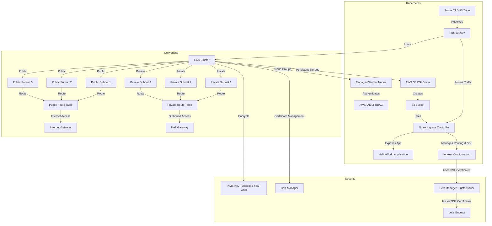

# EKS Cluster Setup and S3 Image Display Service

## Overview

In this interview challenge, you are tasked with creating a fully functional Kubernetes cluster on AWS using **Amazon EKS** (Elastic Kubernetes Service). The main goal of the challenge is to deploy a service that fetches and displays an image stored in an **S3** (Simple Storage Service) bucket. You will utilize the **mountpoint-s3-csi-driver**, enabling Kubernetes pods to mount S3 buckets as file systems.

The challenge tests your understanding of the following:
- **Kubernetes resource management** and best practices
- **AWS services**, such as EKS and S3
- Integration of third-party drivers like the **mountpoint-s3-csi-driver**
- Ensuring **security**, **scalability**, **documentation**, and **maintainability**

The task also requires you to demonstrate a solution that avoids the use of **InitContainers**, encouraging you to explore other methods for resource initialization.

By the end of the challenge, you should have a working service that:
- Displays an image from an S3 bucket.
- Integrates Kubernetes with AWS services.
- Uses a public domain for external access.

Please ensure your solution is properly documented, secure, and scalable. Additionally, include an **architecture diagram** to outline the details of your setup.

## Architecture Diagram

## Links to Related Documents

- [Network README.md](./accounts/new-work/network/README.md)
- [Security README.md](./accounts/new-work/security/README.md)
- [Workload Creation README.md](./accounts/new-work/workload/creation/README.md)
- [Workload Configuration README.md](./accounts/new-work/workload/configuration/README.md)

[➡️ Next](./accounts/new-work/network/README.md)