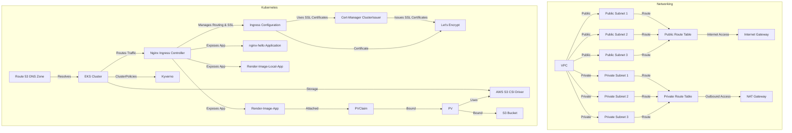

# EKS Cluster Setup and S3 Image Display Service

## Overview

In this interview challenge, you are tasked with creating a fully functional Kubernetes cluster on AWS using **Amazon EKS** (Elastic Kubernetes Service). The main goal of the challenge is to deploy a service that fetches and displays an image stored in an **S3** (Simple Storage Service) bucket. You will utilize the **mountpoint-s3-csi-driver**, enabling Kubernetes pods to mount S3 buckets as file systems.

The challenge tests your understanding of the following:
- **Kubernetes resource management** and best practices
- **AWS services**, such as EKS and S3
- Integration of third-party drivers like the **mountpoint-s3-csi-driver**
- Ensuring **security**, **scalability**, **documentation**, and **maintainability**

The task also requires you to demonstrate a solution that avoids the use of **InitContainers**, encouraging you to explore other methods for resource initialization.

By the end of the challenge, you should have a working service that:
- Displays an image from an S3 bucket.
- Integrates Kubernetes with AWS services.
- Uses a public domain for external access.

Please ensure your solution is properly documented, secure, and scalable. Additionally, include an **architecture diagram** to outline the details of your setup.

## Architecture Diagram

## Links to Related Documents

- [Network](./accounts/new-work/network/README.md)
- [Security](./accounts/new-work/security/README.md)
- [Workload Creation](./accounts/new-work/workload/creation/README.md)
- [Workload Configuration](./accounts/new-work/workload/configuration/README.md)

## How to acess to Applications Exposed:

Here’s the updated table with the **Save Hosts File** step removed:
Here’s the updated table with the **`nslookup`** command added for **Windows** and **Mac**:

| **Step**                       | **Windows**                                           | **Mac**                                                 | **Ubuntu**                                               |
|---------------------------------|-------------------------------------------------------|---------------------------------------------------------|---------------------------------------------------------|
| **Open and Edit Hosts File**    | Open **Notepad as Administrator**, then open file: `C:\Windows\System32\drivers\etc\hosts` | Open **Terminal**, then run: `sudo nano /etc/hosts`     | Run: `sudo nano /etc/hosts`                              |
| **Add Entry**                   | Add: `54.217.92.88   new-work-se-test.com`            | Add: `54.217.92.88   new-work-se-test.com`              | Add: `54.217.92.88   new-work-se-test.com`              |
| **Check DNS Resolution**        | Run: `nslookup new-work-se-test.com`                  | Run: `nslookup new-work-se-test.com`                    | Run: `nslookup new-work-se-test.com`                     |

### 1. **nginx-hello Application**
- **URL:** [https://new-work-se-test.com/hello](https://new-work-se-test.com/hello)
- **Access Instructions:**  
  Simply open the URL in a web browser to view the "nginx-hello" application. This might be a basic Nginx application serving a simple "Hello" page.

### 2. **Render-Image-Local-App**
- **URL:** [https://new-work-se-test.com/render-image-local/image.jpg](https://new-work-se-test.com/render-image-local/image.jpg)
- **Access Instructions:**  
  Open this URL in a web browser to view the image served by the "Render-Image-Local-App". The application seems to expose a local image at the specified path.

### 3. **Render-Image-App**
- **URL:** [https://new-work-se-test.com/render-image/image.jpg](https://new-work-se-test.com/render-image/image.jpg)
- **Access Instructions:**  
  Open this URL in a web browser to view the image served by the "Render-Image-App". Similar to the previous app, it seems to serve an image, but possibly with additional logic or processing involved in rendering.

[➡️ Next](./accounts/new-work/network/README.md)