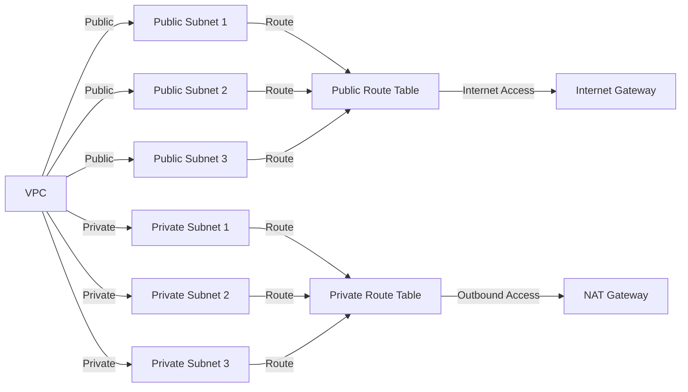

# AWS EKS Networking Module

This step provisions the networking infrastructure required for an Amazon EKS cluster. It sets up a Virtual Private Cloud (VPC) with public and private subnets, an Internet Gateway, a NAT Gateway, and route tables to ensure proper network communication.

## Overview

The module is divided into two main steps:

1. **Network Creation**: Defines the VPC, public and private subnets, internet gateway, NAT gateway, and route tables.
2. **Network Configuration**: Associates the subnets with their respective route tables.

## Features
- Creates a VPC with a customizable CIDR block.
- Provisions three public and three private subnets across different Availability Zones.
- Configures an Internet Gateway for public subnets.
- Deploys a NAT Gateway for private subnets to allow outbound internet access.
- Sets up public and private route tables.
- Associates public and private subnets with their respective route tables.

## Current Architecture Diagram



## Architecture Overview
```
VPC (10.0.0.0/16)
│
├── Public Subnets
│   ├── public-subnet-1 (10.0.1.0/24) [eu-west-1a]
│   ├── public-subnet-2 (10.0.2.0/24) [eu-west-1b]
│   ├── public-subnet-3 (10.0.3.0/24) [eu-west-1c]
│   ├── Internet Gateway (IGW)
│   ├── Public Route Table (0.0.0.0/0 -> IGW)
│   ├── Associations between public subnets and public route table
│
├── Private Subnets
│   ├── private-subnet-1 (10.0.4.0/24) [eu-west-1a]
│   ├── private-subnet-2 (10.0.5.0/24) [eu-west-1b]
│   ├── private-subnet-3 (10.0.6.0/24) [eu-west-1c]
│   ├── NAT Gateway (for outbound internet access from private subnets)
│   ├── Private Route Table (0.0.0.0/0 -> NAT Gateway)
│   ├── Associations between private subnets and private route table
```

## Resources Created
- **VPC**: `aws_vpc.eks_vpc`
- **Public Subnets**:
    - `aws_subnet.public_subnet_1`
    - `aws_subnet.public_subnet_2`
    - `aws_subnet.public_subnet_3`
- **Private Subnets**:
    - `aws_subnet.private_subnet_1`
    - `aws_subnet.private_subnet_2`
    - `aws_subnet.private_subnet_3`
- **Internet Gateway**: `aws_internet_gateway.igw`
- **NAT Gateway**: `aws_nat_gateway.nat_gw`
- **Route Tables**:
    - Public Route Table: `aws_route_table.public_rt`
    - Private Route Table: `aws_route_table.private_rt`
- **Route Table Associations**:
    - Public Subnets:
        - `aws_route_table_association.public_assoc_1`
        - `aws_route_table_association.public_assoc_2`
        - `aws_route_table_association.public_assoc_3`
    - Private Subnets:
        - `aws_route_table_association.private_assoc_1`
        - `aws_route_table_association.private_assoc_2`
        - `aws_route_table_association.private_assoc_3`

## Requirements
- Terraform >= 1.0.0
- AWS CLI configured with credentials

## Outputs
- `vpc_id`: The ID of the created VPC.
- `public_subnets`: List of created public subnets.
- `private_subnets`: List of created private subnets.
- `igw_id`: Internet Gateway ID.
- `nat_gw_id`: NAT Gateway ID.
- `public_route_table_id`: ID of the public route table.
- `private_route_table_id`: ID of the private route table.

[🔙 Return](../../../README.md) | [➡️ Next](../security/README.md)