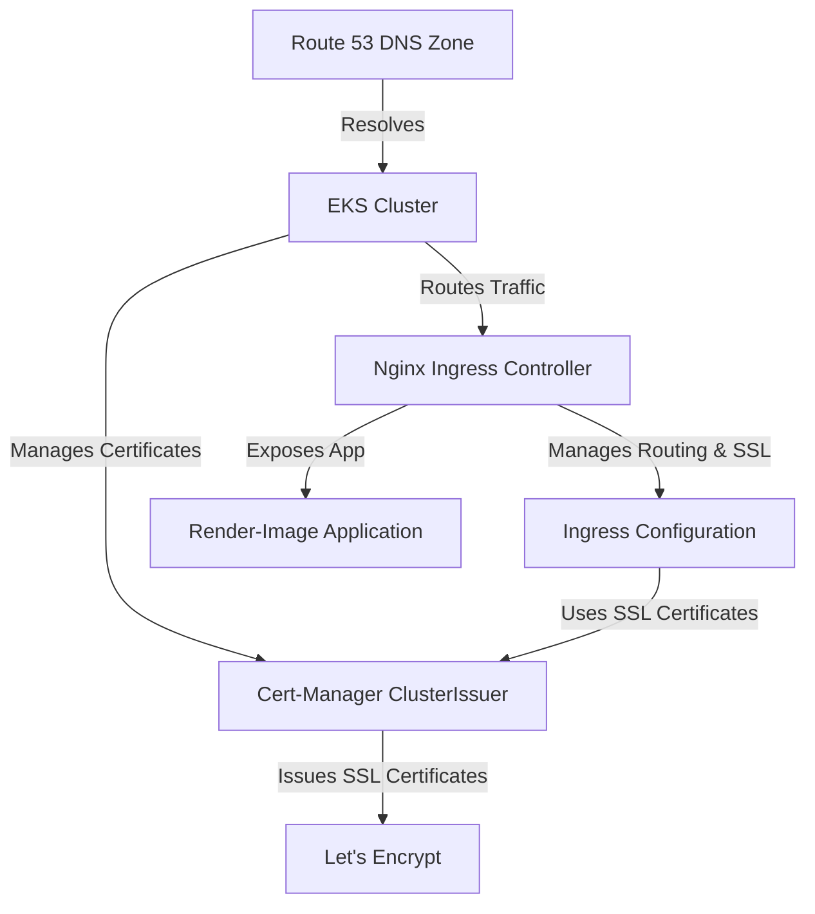

# EKS Cluster Configuration

This module configures essential services and networking for the **EKS cluster**.

## Overview

The configuration includes:
- **DNS Management** with AWS Route 53
- **SSL Certificates** using Cert-Manager and Let's Encrypt
- **Ingress Controller** with Nginx
- **Hello-World Application** for testing

## Resources Configured

### **Route 53 DNS Zone**
- Creates a **Route 53 hosted zone** for the public domain.
- Ensures DNS resolution for services within the cluster.

### **Cert-Manager ClusterIssuer**
- Sets up **Let's Encrypt ACME issuer** for automatic SSL certificate management.
- Uses **HTTP-01 challenge** via the **Nginx Ingress Controller**.

### **Nginx Ingress Controller**
- Deploys an **Ingress Controller** to manage external traffic.
- Routes requests to internal services securely.

### **Hello-World Application**
- Deploys a basic **test application** to validate the cluster’s functionality.

### **Ingress Configuration**
- Defines an **Ingress resource** to expose applications via the configured domain.

## Architecture

## Prerequisites
- **EKS Cluster** must be deployed.
- **Cert-Manager** must be installed.
- **Terraform & Kubectl** must be configured.

## Outputs
- **DNS Zone ID** for Route 53
- **Ingress Controller Deployment** status
- **Hello-World App URL**

## Security Considerations
- Uses **Let's Encrypt** for free SSL/TLS certificates.
- **Ingress rules** ensure controlled access.
- **DNS resolution** prevents misconfigured domains.

[🔙 Return](../creation/README.md) | [➡️ Index](../../../../README.md)