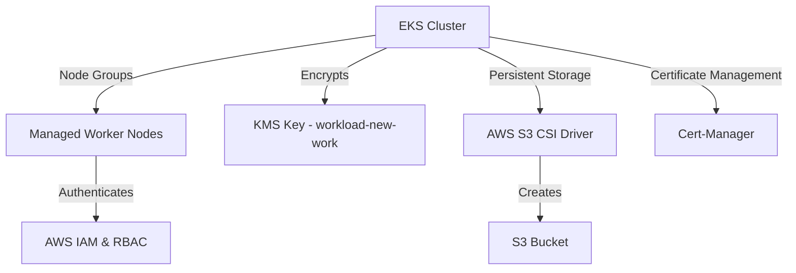

# EKS Cluster Deployment

This Terraform module provisions an Amazon EKS cluster along with essential configurations and integrations.

## Overview

The setup includes:
- **Amazon EKS Cluster** with managed node groups
- **Cluster encryption** using AWS KMS
- **IAM authentication** and RBAC configuration
- **AWS S3 CSI Driver** for persistent storage
- **Cert-Manager** for managing TLS certificates

## Resources Created

### **Amazon EKS Cluster**
- **EKS Cluster** with IAM authentication
- **Managed Node Groups** for worker nodes
- **Cluster Encryption** using AWS KMS
- **Private Networking** with VPC subnets
- **Public & Private API Endpoint Access**

### **IAM Configuration**
- Configures `aws-auth` to manage users and roles
- Grants `system:masters` privileges to the specified IAM user
- Associates EC2 nodes with Kubernetes RBAC roles

### **Storage**
- Deploys **AWS S3 CSI Driver**
- Creates an **S3 bucket** for application storage

### **Cert-Manager**
- Installs Cert-Manager to handle TLS certificates for services

## Architecture

## Prerequisites
- Terraform `>= 1.0.0`
- AWS CLI configured with credentials
- Existing VPC with private subnets

## Outputs
- `eks_cluster_id` – EKS cluster ID
- `eks_oidc_issuer_url` – OIDC provider for IAM roles
- `bucket_name` – S3 bucket name for persistent storage

## Security Considerations
- **IAM policies** control access to the cluster
- **KMS encryption** secures secrets and sensitive data
- **Private subnets** enhance security by isolating resources

[🔙 Return](../../security/README.md) | [➡️ Next](../configuration/README.md)